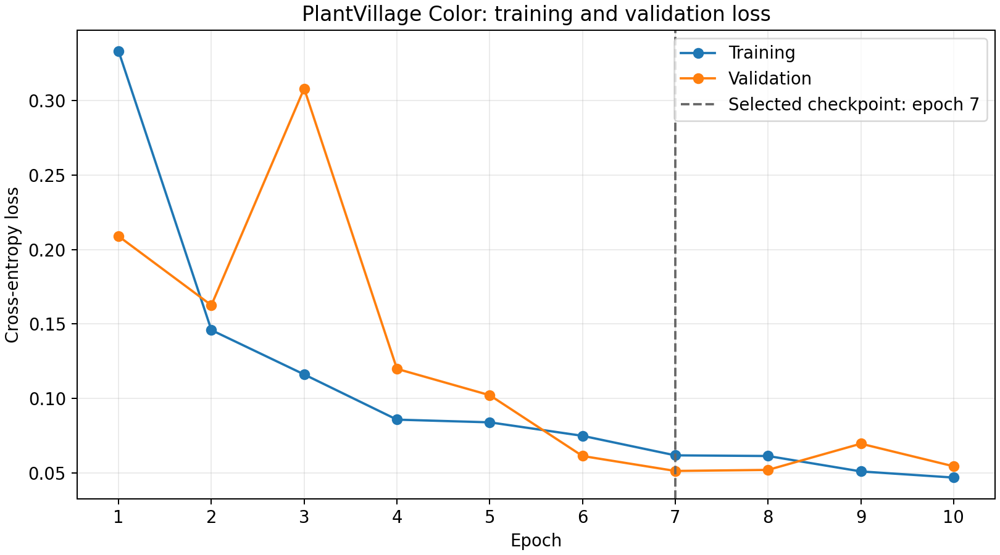
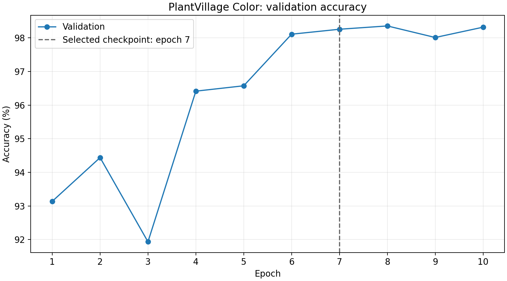
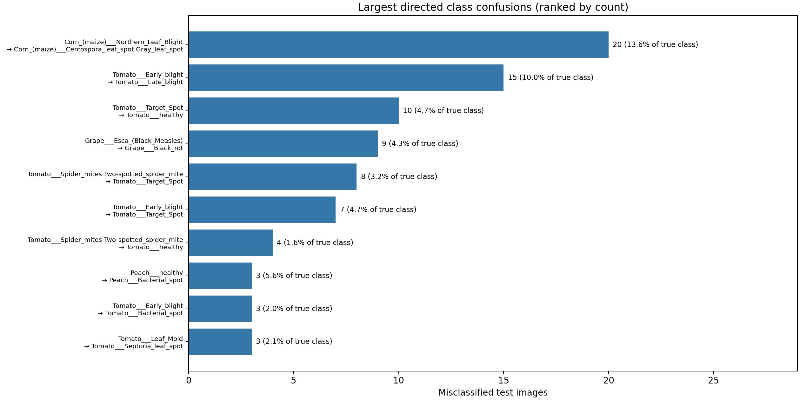

# Week 5 baseline analysis

Source: `train_20260916T171709Z_f582a465`. Completed ImageNet-pretrained ResNet-18 fine-tuning,
38 PlantVillage Color classes, seed 42, 10 epochs.
Splits: 38,013 train / 8,146 validation / 8,146 test.
Batch size 32; AdamW learning rate 0.001,
weight decay 0.0001; 224-pixel RGB input.

## Training behavior and checkpoint selection

Training loss fell from 0.33319 to 0.04682.
Validation loss fell overall from 0.20891 to 0.05439,
with a temporary spike at epoch 3 (0.30816) and another rise at epoch 9 (0.06958).
Validation accuracy increased from 93.14% to 98.32%.
Late validation improvements level off while training loss keeps declining; the short,
fluctuating series does not establish sustained severe overfitting. Training augmentation
and train/evaluation modes differ, so training and validation losses are not directly equivalent.

**Selected checkpoint: epoch 7**, with the lowest validation loss
**0.05126** and validation accuracy **98.26%**.
The highest validation accuracy was epoch 8 (98.36%),
but selection used validation loss. The saved test results refer to the selected checkpoint.
No checkpoint was loaded or model evaluation repeated in this analysis.




## Test results

- Accuracy: **98.31%** (8,008/8,146 correct; 138 errors).
- Macro F1: **0.978048**; support-weighted F1: **0.983005**.
- Saved test cross-entropy loss: **0.050647**.

Accuracy and macro F1 were independently recomputed from the count matrix and match
the saved metrics. Loss is quoted from metrics.json; counts cannot reconstruct it.

## Class-level observations

The complete 38-class table is [class_metrics.csv](class_metrics.csv), in saved class-index order.
Precision = TP/predicted count; recall = TP/true support; F1 = 2TP/(true support + predicted count).
Undefined ratios use zero, matching evaluation. Values below are fractions, not percentages.
The eight lowest-F1 classes are:

| Class | Precision | Recall | F1 | Support |
| --- | --- | --- | --- | --- |
| Corn_(maize)___Cercospora_leaf_spot Gray_leaf_spot | 0.7938 | 1.0000 | 0.8851 | 77 |
| Tomato___Early_blight | 0.9760 | 0.8133 | 0.8873 | 150 |
| Tomato___Target_Spot | 0.9083 | 0.9384 | 0.9231 | 211 |
| Corn_(maize)___Northern_Leaf_Blight | 1.0000 | 0.8639 | 0.9270 | 147 |
| Tomato___Late_blight | 0.9329 | 0.9686 | 0.9504 | 287 |
| Potato___healthy | 0.9200 | 1.0000 | 0.9583 | 23 |
| Tomato___Leaf_Mold | 1.0000 | 0.9231 | 0.9600 | 143 |
| Peach___healthy | 0.9808 | 0.9444 | 0.9623 | 54 |

Corn Cercospora/Gray Leaf Spot has perfect recall but reduced precision because other
classes are predicted as it; this differs from tomato Early Blight, whose main weakness
is missed true cases (recall 81.33%). Support ranges from 23 to 826 images.
Small classes such as healthy potato (23 images) have less stable estimates; high
aggregate accuracy should not obscure class imbalance. 7 classes have F1 = 1 on this test split,
which does not imply perfect population performance.

## Confusion-matrix observations

Rows represent true labels; columns represent predictions. Ranked by off-diagonal count:

| True class → predicted class | Count | % of true class |
| --- | --- | --- |
| Corn_(maize)___Northern_Leaf_Blight → Corn_(maize)___Cercospora_leaf_spot Gray_leaf_spot | 20 | 13.61% |
| Tomato___Early_blight → Tomato___Late_blight | 15 | 10.00% |
| Tomato___Target_Spot → Tomato___healthy | 10 | 4.74% |
| Grape___Esca_(Black_Measles) → Grape___Black_rot | 9 | 4.35% |
| Tomato___Spider_mites Two-spotted_spider_mite → Tomato___Target_Spot | 8 | 3.17% |
| Tomato___Early_blight → Tomato___Target_Spot | 7 | 4.67% |
| Tomato___Spider_mites Two-spotted_spider_mite → Tomato___healthy | 4 | 1.59% |
| Peach___healthy → Peach___Bacterial_spot | 3 | 5.56% |
| Tomato___Early_blight → Tomato___Bacterial_spot | 3 | 2.00% |
| Tomato___Leaf_Mold → Tomato___Septoria_leaf_spot | 3 | 2.10% |

The largest pair is corn Northern Leaf Blight → Cercospora/Gray Leaf Spot:
20 images, 13.61% of that true class. Tomato Early Blight → Late Blight follows with
15 images, 10.00% of true Early Blight. Together these account for 25.36% of all errors.
110/138 errors are within the same crop (crop inferred from the label prefix).
These counts locate weaknesses but do not prove visual similarity, annotation error,
or any other cause; reviewing individual images would be needed.



All nonzero directed confusions and both count-normalized rates are in
[class_confusions.csv](class_confusions.csv). Count ranking favors larger classes;
the accompanying source-class rates and supports provide context.

## Limitations

- PlantVillage test performance **does not establish field-image generalization**.
  No independent field dataset, lighting/background shift, or deployment test was evaluated.
- This is one seed and one fixed split; no repeated-run uncertainty estimates are available.
- Split hashes and class supports are verified, but this analysis does not audit duplicate
  images, plant-level independence, or possible split leakage.
- Aggregate artifacts support per-class metrics, but not calibration, ROC/PR curves,
  confidence analysis, or identifying particular misclassified image files.
- No raw images or model weights were read, no retraining occurred, and run outputs were unchanged.

## Reproduction

From the repository root, with the project dependencies and Matplotlib installed:

```powershell
python -B -m scripts.analysis.week_05
```

Optional arguments: `--run <repository-relative run directory>` and `--output <analysis directory>`.
The script regenerates its named files; keep personal notes elsewhere. PNG and SVG
plots, CSV tables, and this Markdown report are generated from the four saved inputs.
[provenance.json](provenance.json) records input/script hashes, checked manifest hashes,
and library versions. Original input hashes are checked again after generation.
